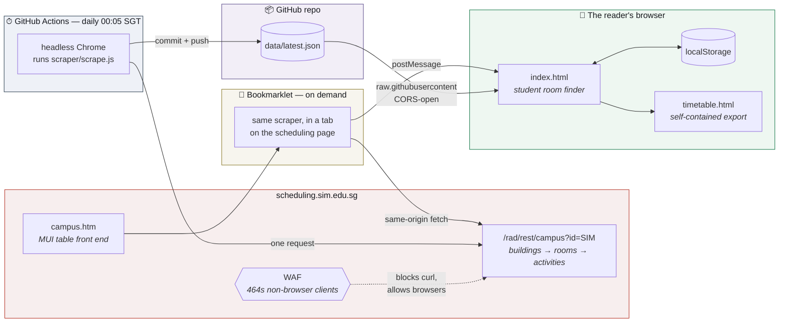

# Architecture

**Live:** https://simtimetable.vercel.app · **Repo:** https://github.com/Shisa2025/simtimetable

For *why* it is shaped this way, see [docs/PRD.md](docs/PRD.md).
For implementation depth — data contracts, algorithms, failure modes — see
[docs/TECHNICAL-DESIGN.md](docs/TECHNICAL-DESIGN.md).

---

## The one-sentence version

A GitHub Action reads SIM's own campus API once a day and commits the result to this repo; the
static viewer fetches that file and renders it as a per-room open/busy/gap timeline.

## System diagram



## The two constraints that shape everything

**1. The schedule needs no login.** This was discovered late, and it removed the original
constraint entirely. Earlier versions of this project assumed the data sat behind a SIM session
and therefore built a browser-side scraper plus a scheduled task on the author's laptop. None of
that is needed: the page and its API are public, so a cloud job can do the work and nobody's
machine has to be awake.

**2. But the API only answers browsers.** `scheduling.sim.edu.sg` sits behind a WAF that returns
**464** to plain HTTP clients — `curl` is refused even for the HTML page, with or without a
browser User-Agent, Accept or Referer. So every read, cloud or local, goes through a real
Chromium engine. That is the single reason this project launches a browser to perform what is
otherwise one GET.

There is a third, softer constraint: the API sends no `Access-Control-Allow-Origin`, so it is
same-origin only. The room finder cannot call it directly from `simtimetable.vercel.app` — hence the
published-file feed, and hence the bookmarklet running *on* the scheduling page.

## Why the API instead of the table

The page renders 54 paginated pages of seven rows. Reading the API instead is not just faster:

| | rendered table | campus API |
| --- | --- | --- |
| Requests | ~54 clicks, ~70s | 1, ~1s |
| Auto-advance race | must be defended against | not applicable |
| Times | `"8:00 AM"` strings, nbsp-separated | exact `2026-08-24 08:00:00` |
| Room capacity | absent | in each room's description |
| Rooms with no bookings | invisible | listed — 170 of 326, though unbooked is not open |
| **Free Access windows** | present but buried | **explicit — 38 rooms today** |

That last row is the important one. The table can only show rooms that are busy, so the question
"which rooms are open to students?" was hard to answer from it.

## Components

| Path | Runs where | Responsibility |
| --- | --- | --- |
| `scraper/scrape.js` | a tab on scheduling.sim.edu.sg | **The only** read-and-transform implementation. Bookmarklet by default; returns its payload instead when `window.__SIM_SCRAPE_HEADLESS__` is set |
| `scripts/fetch-schedule.mjs` | CI, or locally | Opens the page headless and evaluates `scrape.js`; writes `data/latest.json` |
| `scripts/lib/cdp.mjs` | CI, or locally | Dependency-free CDP client — launch, open, evaluate |
| `.github/workflows/daily-schedule.yml` | GitHub Actions | 00:05 SGT cron; runs the fetch and commits the result |
| `data/latest.json` | the repo | The published feed |
| `index.html`, `assets/app.js` | Vercel → browser | Load the feed, import, persist, export, and hand off data |
| `assets/timetable.js` | browser | **All** Singapore-time filtering and rendering. Pure, no I/O |
| `scripts/serve.mjs`, `scripts/test-handoff.mjs` | local dev | Static server; end-to-end handoff test |

## Three structural decisions

**1. One implementation of read-and-transform.** `scripts/fetch-schedule.mjs` does not parse
anything. It evaluates `scraper/scrape.js` — the same file the bookmarklet runs — with a flag
that makes it return the payload rather than open a viewer tab. A second copy would drift, and
the drift would be silent.

**2. `assets/timetable.js` is the single renderer and does no I/O.** It is
`mount(element, rows, {rooms})` and nothing else. That is what lets the standalone export inline
this exact file and call the same `mount()`, so the exported page and the live viewer cannot
diverge.

**3. The advanced tools page never hardcodes the scraper source.** It fetches `/scraper/scrape.js` at
runtime and uses that one string for both the visible code block and the bookmarklet's
`javascript:` URL — so what you read, what you copy, and what the bookmarklet runs are the same
bytes.

## Data flow

```
campus API   buildings[] → rooms[] → activities[]
     │  scrape.js: blockOf / floorOf / parseStamp
     ▼
payload      { version: 2, rooms[], rows[], schedule_dates[], scraped_at }
     │  rooms[] carries every room + its activity count (0 = nothing booked,
     │           which is NOT the same as open to students)
     │  rows[]  carries every booking; a "Free Access" event means students may use it
     ▼
room finder  fetch feed → coerce() → SIMTimetable.mount(rows, {rooms})
     ▼
             filter → { open now | daily OPEN/BUSY/UNKNOWN timeline | full schedule }
```

`start_min` / `end_min` drive every comparison; the `"4:00 PM"` strings are display only.
Booking status is **not** trusted from the payload — a status written at 00:05 would still claim
`UPCOMING` at 3pm — so the renderer recomputes it in the `Asia/Singapore` time zone.

## Deployment

Two independent pipelines, which is deliberate:

- **Data** — GitHub Actions → `data/latest.json` → read by the viewer over
  `raw.githubusercontent.com`. Needs no deploy, so the schedule refreshes without touching the
  site.
- **Site** — Vercel is connected to the GitHub repository. A push to `main` creates the
  production deployment automatically.
